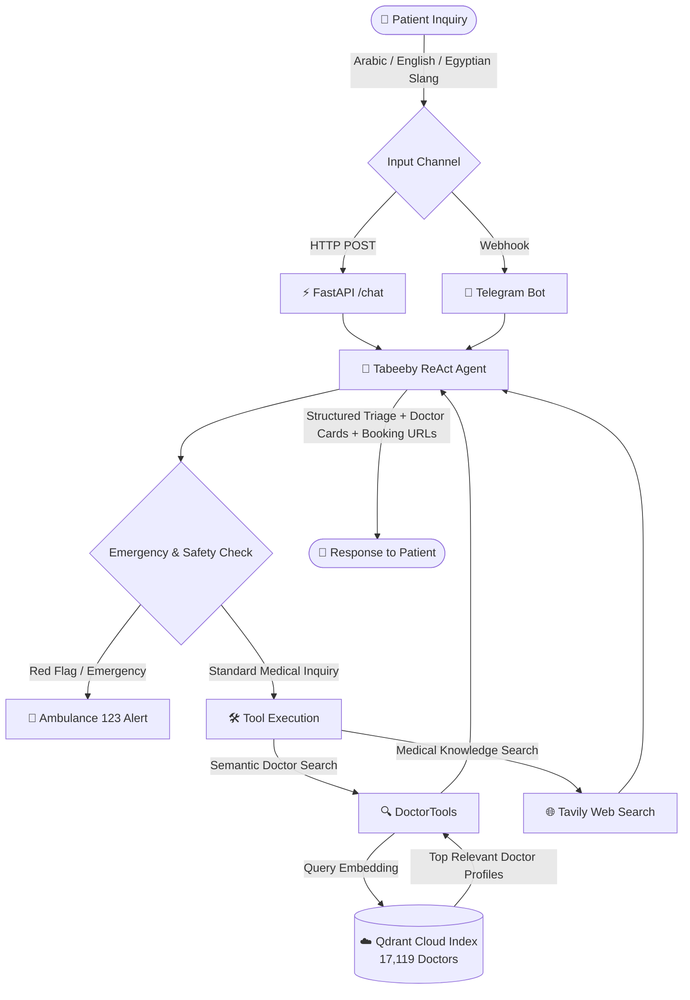

# 🩺 Tabeeby Agent (طبيبي) — Autonomous AI Medical Assistant & Doctor Finder

<p align="center">
  
  
  
  
  
</p>

---

## 🌟 Live Demo & Deployment

| Platform | Deployment Details | Link |
| :--- | :--- | :--- |
| **🤖 Telegram Bot** | Deployed on **FastAPI Cloud** + **Qdrant Cloud** | 👉 [**@tabeeby_bot on Telegram**](https://t.me/tabeeby_bot) |
| **⚡ REST API** | FastAPI interactive Swagger docs | `http://localhost:8000/docs` |

---

## 📹 Video Demo

<!-- Add your video recording or GIF demo below -->
> 🎬 **Demo Video Coming Soon**  
> _A comprehensive walkthrough demonstrating clinical triage, colloquial Arabic symptom queries, real-time doctor retrieval from Qdrant Cloud, and direct booking recommendations on Telegram._

[](#)

---

## 📌 Overview

**Tabeeby (طبيبي)** is an enterprise-grade, autonomous AI Medical Healthcare Navigator designed specifically for Egyptian and Middle Eastern healthcare contexts. Powered by the **Vezeeta** medical catalog of **17,000+ registered doctors**, Tabeeby bridges the gap between patient complaints (in English, standard Arabic, or Egyptian slang) and verified specialist doctors.

### ✨ Key Capabilities
* **🧠 Smart Clinical Triage**: Intelligently deduces the required medical specialty (e.g. `"ضرس بيوجعني"` $\to$ **Dentistry**, `"وجع شديد في الصدر"` $\to$ **Cardiology**, `"تأخر حمل"` $\to$ **Reproductive Medicine & Infertility**).
* **🔍 Unified Vector Similarity Search**: Embeds all doctor dimensions (**Name, Specialty, Subspecialties, Symptoms, Clinic Location/Neighborhood, Consultation Fee, and Bio**) into dense semantic vectors indexed in **Qdrant Cloud**.
* **🚑 Emergency Red Flag Protocols**: Instantly detects acute life-threatening symptoms (stroke, crushing chest pain, severe hemorrhage) and directs patients to emergency services (**Dial 123 in Egypt**).
* **🔗 Direct Booking Links**: Recommends verified doctors with direct Vezeeta booking URLs, fees in EGP, ratings, and exact clinic addresses.
* **🌐 Medical Web Search**: Leverages Tavily API for supplementary clinical lookups, rare condition explanations, and drug interaction inquiries.
* **💬 Omnichannel Availability**: Connects via high-performance **FastAPI REST API** and interactive **Telegram Webhook Bot**.

---

## 🏗️ Architecture & Workflow



---

## 📂 Project Structure

```text
Tabeeby-Agent/
├── .env.example                     # Environment configuration template
├── README.md                        # Project documentation
├── src/
│   ├── app.py                       # FastAPI application & lifespan setup
│   ├── pyproject.toml               # Project dependencies (uv / pip)
│   ├── agent/
│   │   └── agent.py                 # Autonomous ReAct Agent engine
│   ├── assets/
│   │   ├── database/qdrant_db/      # Local pre-embedded SQLite database (17K points)
│   │   └── files/vezeeta.csv        # Raw Vezeeta dataset
│   ├── helpers/
│   │   └── config.py                # Pydantic Settings & environment loader
│   ├── models/
│   │   └── doctor.py                # DoctorRecord model & semantic text builder
│   ├── prompts/
│   │   └── prompt_templatet.py      # Clinical triage system prompts & templates
│   ├── routes/
│   │   ├── chat.py                  # POST /chat REST endpoint
│   │   └── telegram.py              # POST /telegram/webhook integration
│   ├── scripts/
│   │   ├── ingest_vezeeta.py        # End-to-end embedding & ingestion pipeline
│   │   └── migrate_to_cloud.py      # Instant cloud restoration from local SQLite
│   ├── stores/
│   │   ├── llm/                     # LLM providers (Gemini, OpenAI, Ollama, Groq)
│   │   └── vectordb/                # Qdrant Vector DB providers & interfaces
│   └── tools/
│       ├── search_doctors.py        # Vector search doctor tool
│       ├── web_tools.py             # Tavily medical search tool
│       └── memory.py                # Session scratchpad & memory tools
```

---

## ⚙️ Prerequisites & Requirements

* **Python**: `3.10` or higher
* **Package Manager**: [`uv`](https://github.com/astral-sh/uv) (recommended) or `pip`
* **Qdrant**: Free cluster on [Qdrant Cloud](https://cloud.qdrant.io) or local instance
* **LLM Provider**: [Google AI Studio](https://aistudio.google.com/) API Key (Gemini) or OpenAI / Ollama

---

## 🚀 Quickstart & Installation

### 1. Clone the Repository
```bash
git clone https://github.com/amr10w/Tabeeby-Agent.git
cd Tabeeby-Agent/src
```

### 2. Set Up Virtual Environment & Dependencies

Using **`uv`** (Recommended):
```bash
# Create virtual environment and sync dependencies
uv venv
source .venv/bin/activate   # On Windows: .venv\Scripts\activate
uv sync
```

Using **Standard `pip`**:
```bash
python3 -m venv .venv
source .venv/bin/activate   # On Windows: .venv\Scripts\activate
pip install -e .
```

---

## 🔑 Environment Configuration

Create a `.env` file inside the `src/` directory:

```ini
# Application Identity
APP_NAME=Tabeeby
APP_VERSION=1.0.0

# LLM Generation Configuration
GENERATION_BACKEND=GEMINI
GENERATION_MODEL_ID=gemini-2.5-flash
GENERATION_DAFAULT_MAX_TOKENS=1500
GENERATION_DAFAULT_TEMPERATURE=0.1
GEMINI_API_KEY=your_gemini_api_key_here

# Embedding Configuration
EMBEDDING_BACKEND=GEMINI
EMBEDDING_MODEL_ID=text-embedding-004
EMBEDDING_MODEL_SIZE=768

# Qdrant Cloud Vector Database
VECTOR_DB_BACKEND=QDRANT
VECTOR_DB_URL=https://your-cluster-id.aws.cloud.qdrant.io
VECTOR_DB_API_KEY=your_qdrant_api_key_here
VECTOR_DB_COLLECTION_NAME=tabeeby_doctors
VECTOR_DB_DISTANCE_METHOD=cosine

# Optional: Medical Web Search (Tavily)
TAVILY_API_KEY=your_tavily_api_key_here

# Optional: Telegram Webhook Bot
TELEGRAM_BOT_TOKEN=your_telegram_bot_token_here
TELEGRAM_WEBHOOK_URL=https://your-domain.com/telegram/webhook
```

---

## 🗄️ Database Ingestion & Cloud Migration

You have **two fast options** to populate your Qdrant Vector DB:

### Option A: Instant Migration from Local SQLite (Fastest — No embedding API needed)
Migrate the pre-embedded 17,119 doctor vectors directly from `assets/database/qdrant_db` to Qdrant Cloud:

```bash
uv run python -m scripts.migrate_to_cloud --collection-name tabeeby_doctors --reset
```

### Option B: Fresh Embedding from CSV
Re-embed the dataset using your configured embedding model (`GEMINI`, `OLLAMA`, etc.):

```bash
uv run python -m scripts.ingest_vezeeta --reset --batch-size 64
```

---

## 🖥️ Running the Application

### 1. Launch the FastAPI Server
```bash
uv run uvicorn app:app --host 0.0.0.0 --port 8000 --reload
```

* API Documentation: [http://127.0.0.1:8000/docs](http://127.0.0.1:8000/docs)
* Health Check: `GET http://127.0.0.1:8000/`

---

## 📡 API Usage & Examples

### 🔍 Chat Endpoint (`POST /chat`)

**Request**:
```bash
curl -X 'POST' \
  'http://127.0.0.1:8000/chat' \
  -H 'Content-Type: application/json' \
  -d '{
  "prompt": "عايز دكتور نساء وتوليد شاطر في حدائق القبة وسعره معقول",
  "chat_history": [],
  "total_cost": 0
}'
```

**Response**:
```json
{
  "signal": "llm_generate_success",
  "response": "أهلاً بك! بالنسبة لحالتك، يُفضل المتابعة مع طبيب متخصص في **أمراض النساء والتوليد وعلاج العقم**.\n\nإليك أفضل الأطباء المتاحين في منطقة **حدائق القبة**:\n\n1. **د. يوسف صبحي** (استشاري أمراض النساء والتوليد وعلاج العقم)\n   - 📍 **العيادة**: حدائق القبة\n   - 💰 **سعر الكشف**: 300 جنيه مصري\n   - ⭐ **التقييم**: ★ 4.9 (85 تقييم)\n   - 🔗 **رابط الحجز**: [اضغط هنا للحجز على فيزيتا](https://www.vezeeta.com/ar/dr/doctor-yousef-sobhy)\n\n### 💡 نصائح أولية:\n- يُرجى إحضار نتائج الفحوصات والتحاليل السابقة عند الزيارة.\n\n*ملاحظة: هذه التوصيات للمساعدة والتوجيه ولا تُغني عن الفحص الطبي المباشر.*"
}
```

---

## 🤖 Telegram Bot Integration

Tabeeby seamlessly integrates with Telegram for patient accessibility on mobile.

1. Create a bot using [@BotFather](https://t.me/BotFather) and obtain your `TELEGRAM_BOT_TOKEN`.
2. Expose your local port or deploy on cloud (e.g. Cloudflare Tunnels, Railway, AWS).
3. Set `TELEGRAM_WEBHOOK_URL` in your `.env`.
4. On startup, FastAPI automatically registers the webhook with Telegram.
5. Try out the live deployment directly on Telegram: [**@tabeeby_bot**](https://t.me/tabeeby_bot).

---

## 🛡️ Medical Disclaimer & Safety Protocols

> [!IMPORTANT]
> **Tabeeby is an AI-powered clinical navigation and doctor discovery assistant, NOT a licensed physician.**
> * It does **not** provide definitive clinical diagnoses or prescribe controlled pharmaceutical medications.
> * If experiencing emergency red flags (severe chest pain, difficulty breathing, stroke symptoms, major trauma), patients are instructed to immediately dial **123 (Ambulance in Egypt)** or visit the nearest emergency hospital.

---

## 📄 License & Author

* **Author**: Amr Walid ([@amr10w](https://github.com/amr10w)) — [amrw5189@gmail.com](mailto:amrw5189@gmail.com)
* **Dataset & Source**: Vezeeta Egypt Medical Directory
* **License**: MIT License
