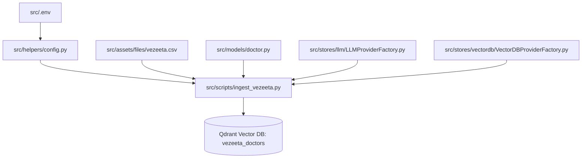

# Scripts & Offline Data Pipelines (`src/scripts`)

This directory contains standalone, offline batch scripts and maintenance utilities for the **Tabeeby Agent** system.

---

## 📌 Overview

The scripts in this directory are responsible for offline Extract, Transform, Load (ETL), data ingestion, vector indexing, and administrative tasks.

Currently, this folder includes:
* [`ingest_vezeeta.py`](file:///home/amrw10/Documents/Tabeeby%20Agent/src/scripts/ingest_vezeeta.py): Reads, validates, embeds, and indexes doctor records from the raw Vezeeta dataset into the Qdrant vector database (`vezeeta_doctors` collection).

---

## ⚙️ Isolated & Separate Process

> [!NOTE]
> **Key Architecture Concept: Offline vs. Online**
> Scripts in this directory run as **isolated, standalone CLI processes** and are **not** part of the live FastAPI / Uvicorn server runtime (`app.py`).

* **Decoupled Execution**: These scripts are intended to run before starting the API server, on a schedule (e.g., cron jobs), or during maintenance/reset windows.
* **Non-blocking**: Long-running operations (e.g., generating embeddings for ~17K doctor profiles) run independently and do not impact the latency or memory footprint of the live agent API.
* **Persistent Output**: The scripts populate and index the persistent Qdrant database (`qdrant_db/`), which the live agent and runtime tools (such as `search_doctors`) query in production.

---

## 🔗 Project Dependencies & Relationships

Although executed as an independent process, the ingestion pipeline deeply relies on shared project modules, configurations, and data assets:



### 1. Data Files
* [`src/assets/files/vezeeta.csv`](file:///home/amrw10/Documents/Tabeeby%20Agent/src/assets/files/vezeeta.csv): The raw dataset containing ~17,000 doctor listings (specialties, clinical descriptions, symptoms, addresses, fees, reviews, URLs).

### 2. Validation & Domain Models
* [`src/models/doctor.py`](file:///home/amrw10/Documents/Tabeeby%20Agent/src/models/doctor.py): Contains the [`DoctorRecord`](file:///home/amrw10/Documents/Tabeeby%20Agent/src/models/doctor.py#L106-L268) Pydantic model. It handles:
  * CSV row parsing and data sanitization (handling missing values, encoding quirks, and negative numbers).
  * Constructing high-signal clinical semantic text (`build_semantic_text()`) for embeddings.
  * Formatting clean payloads (`to_qdrant_payload()`) for storage.

### 3. Application Configuration & Secrets
* [`src/helpers/config.py`](file:///home/amrw10/Documents/Tabeeby%20Agent/src/helpers/config.py): Provides the [`Settings`](file:///home/amrw10/Documents/Tabeeby%20Agent/src/helpers/config.py#L4-L36) container and [`get_settings()`](file:///home/amrw10/Documents/Tabeeby%20Agent/src/helpers/config.py#L37-L43) loader.
* [`src/.env`](file:///home/amrw10/Documents/Tabeeby%20Agent/src/.env): Stores environment variables, including:
  * `EMBEDDING_BACKEND` & `EMBEDDING_MODEL_ID` (e.g., `qwen3-embedding` via Ollama)
  * `VECTOR_DB_BACKEND` & `VECTOR_DB_PATH` (e.g., `qdrant_db`)
  * `VECTOR_DB_DISTANCE_METHOD` (e.g., `cosine`)

### 4. Storage & LLM Provider Factories
* [`src/stores/llm/LLMProviderFactory.py`](file:///home/amrw10/Documents/Tabeeby%20Agent/src/stores/llm/LLMProviderFactory.py): Initializes the embedding provider to generate dense vectors.
* [`src/stores/vectordb/VectorDBProviderFactory.py`](file:///home/amrw10/Documents/Tabeeby%20Agent/src/stores/vectordb/VectorDBProviderFactory.py): Initializes and connects to the Qdrant vector database provider.

---

## 🚀 How to Run

All commands should be executed from the `src/` directory with the virtual environment activated (or via `uv`).

### Prerequisites
1. Ensure your `.env` configuration is present in `src/`.
2. Ensure your embedding provider (e.g., Ollama with the configured model) is running and reachable.
3. Ensure project dependencies are installed via `uv sync` or `pip install -e .`.

---

### Option 1: Using `make` (Recommended)

From the `src/` directory:

```bash
# Reset collection and ingest with a batch size of 64
make ingest

# Ingest without resetting existing collection
make ingest_default
```

---

### Option 2: Using `uv run` / Python Module Execution

Always execute scripts as a module (`-m scripts.<script_name>`) from the `src/` root directory so Python can resolve all parent package imports:

```bash
# Full ingestion with collection reset (recommended for initial setup)
uv run python -m scripts.ingest_vezeeta --batch-size 64 --reset

# Incremental ingestion (keeps existing collection)
uv run python -m scripts.ingest_vezeeta

# Run with verbose / debug logging
uv run python -m scripts.ingest_vezeeta --verbose
```

---

## 🎛️ CLI Arguments Reference

| Argument | Type | Default | Description |
| :--- | :--- | :--- | :--- |
| `--batch-size` | `int` | `64` | Number of records per embedding and insertion batch. |
| `--reset` | `flag` | `False` | Drops and recreates the `vezeeta_doctors` collection before ingesting. |
| `--verbose` | `flag` | `False` | Enables `DEBUG` level logging for detailed diagnostic output. |

---

## 🔄 Ingestion Pipeline Flow

When [`ingest_vezeeta.py`](file:///home/amrw10/Documents/Tabeeby%20Agent/src/scripts/ingest_vezeeta.py) is executed, it runs through the following sequence:

1. **Initialization**: Loads `.env` and initializes the embedding and vector database clients.
2. **Dimension Probing**: Automatically detects the embedding vector size by sending a test medical phrase to the embedding model.
3. **Data Cleaning & Validation**: Reads `vezeeta.csv`, filters corrupt rows, and instantiates [`DoctorRecord`](file:///home/amrw10/Documents/Tabeeby%20Agent/src/models/doctor.py#L106-L268) objects.
4. **Collection Setup**: Creates/resets the `vezeeta_doctors` collection.
5. **Schema Indexing**: Creates Qdrant payload schema indexes:
   * `address` as **KEYWORD** index (for deterministic location filtering).
   * `fee` as **INTEGER** index (for range queries like `gte` / `lte`).
6. **Batch Embedding & Indexing**: Generates embeddings and inserts data in batches with progress tracking (`tqdm`) and error isolation.
7. **Summary & Teardown**: Displays total inserted/skipped records, collection stats, and closes database connections.
